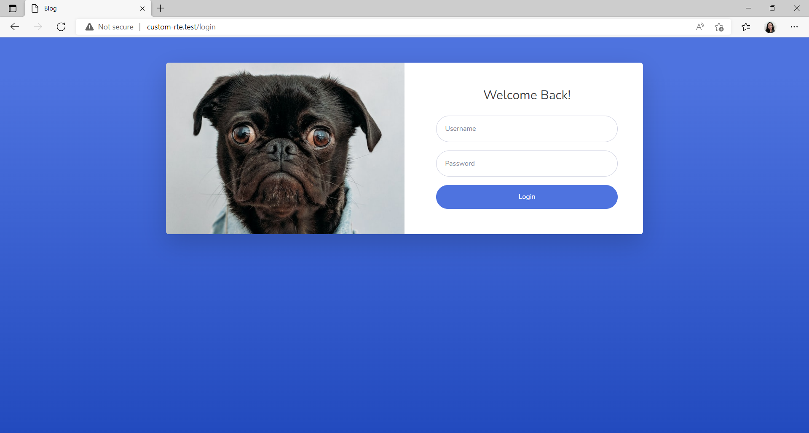
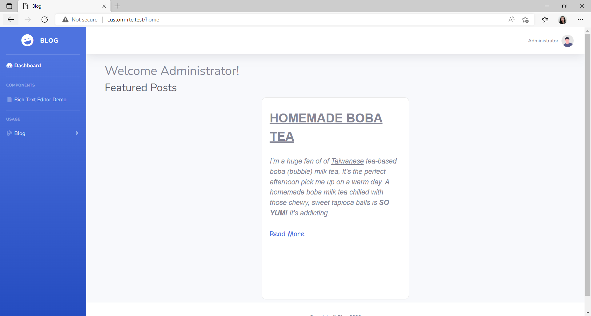

## Tech Stack

**PLEASE USE [PHP VERSION 8](https://www.php.net/downloads.php)**

Backend: [Laravel 8](https://laravel.com/docs/8.x/readme)

Frontend: [VueJS v3](https://vuejs.org/)

    Started:  8/26/2022 10:21 PM
    Finished: 8/29/2022 10:52 AM
    Total: 2 days, 12 hours, 31 minutes

## Getting Started

### Install from repository

Clone the repository:

    git clone https://github.com/monettayy/custom-rte.git

Navigate to the directory and run:

    composer install

Copy the example .env file:

    cp .env.example .env

Generate an application key:

    php artisan key:generate

Run Mix tasks:

    npm run dev

View the website:

    php artisan serve
    
### Setup Database

Create your mysql database,
Go to the .env File and put your database credentials
    
    DB_DATABASE=your-database-here
    DB_USERNAME=root
    DB_PASSWORD=

## Resources

**Admin Template Used**:
[SB Admin 2 - free, open source, Bootstrap 4 based admin theme](https://startbootstrap.com/theme/sb-admin-2)

**Javascript for creating Custom Rich Text Editor**:
[Rich Text Editor With Javascript by CodingArtist](https://codingartistweb.com/2022/04/rich-text-editor-with-javascript/)

**NPM Package for Popups**:
[SweetAlert2](https://www.npmjs.com/package/sweetalert2/v/6.6.1?activeTab=readme)

Other Resources:

- https://javascript.plainenglish.io/make-a-rich-text-editor-with-javascript-in-5-minutes-ee8025694e76

## Testing
### Sample Output
Login

Dashboard

Demo

**Sample Usage**

Create

Update and View 
